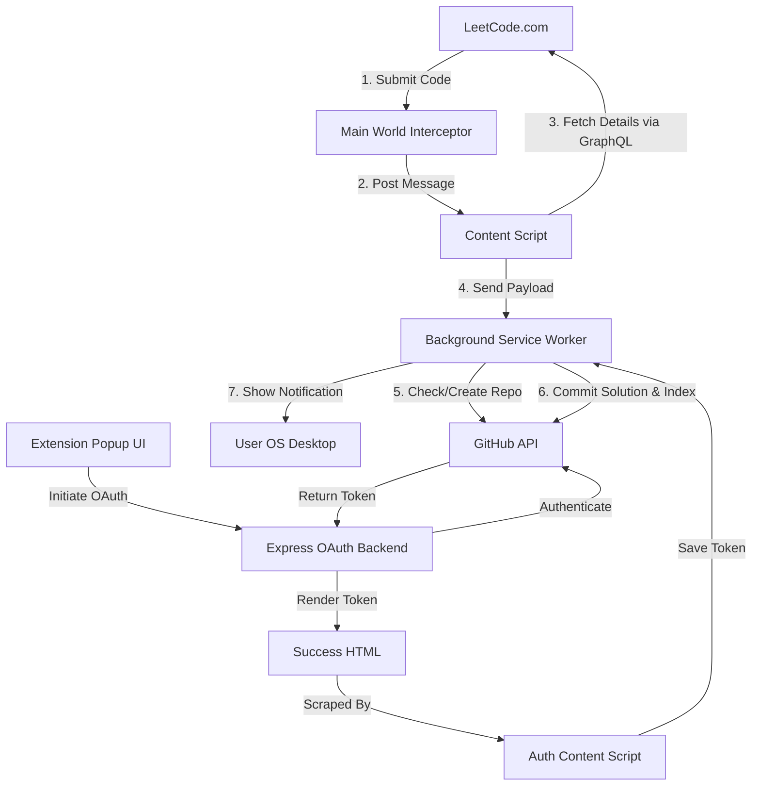

# 🏆 LeetCelebrate - LeetCode Gamification & GitHub Auto-Sync

**LeetCelebrate** is a premium Chrome Extension (Manifest V3) designed to turn the LeetCode grind into a rewarding, addictive, and gamified experience while keeping your personal portfolio updated. 

Instead of just seeing a simple green "Accepted" text, celebrate your victories with high-fidelity canvas confetti animations, procedural success tunes, and a comprehensive XP/leveling system. Simultaneously, the extension can automatically commit and sync your accepted solutions directly to your personal GitHub repository, organized by difficulty, complete with auto-generated metadata and statistics.

---

## ⚡ Quick Start: How to Install & Use LeetCelebrate

Get up and running in less than a minute by following these simple steps:

### 1. Install in Chrome
1. **Fork this repository** by clicking the **Fork** button at the top-right of this page.
2. **Clone your fork** to your local machine (replace `YOUR_USERNAME` with your GitHub username):
   ```bash
   git clone https://github.com/YOUR_USERNAME/LeetCelebrate.git
   ```
3. Open Google Chrome and navigate to **`chrome://extensions/`**.
4. Enable **Developer mode** using the toggle switch in the top-right corner.
5. Click the **Load unpacked** button (top-left) and select the **`chrome-extension/dist`** folder inside your cloned repository.
6. Click the puzzle icon in your Chrome toolbar and **pin LeetCelebrate** to make it always visible.

### 2. Connect Your GitHub
1. Click the **LeetCelebrate** icon on your Chrome toolbar.
2. Click the **Connect GitHub Account** button.
3. Authorize the application on GitHub. The tab will automatically close once linked.

### 3. Solve & Celebrate!
1. Open any coding challenge on [LeetCode](https://leetcode.com/problems/).
2. Submit your solution.
3. Once your code is **Accepted**, watch the confetti rain down, listen to the victory tune, and check the extension popup to see your level up, XP growth, and streaks! Your solution is now automatically committed to your GitHub profile!

---

## 🏗 Repository Structure

To cater to different usage scenarios, this repository is organized into two main parts:

1. **Standalone Extension (Root Directory)**: A lightweight version of the extension written in pure **Vanilla JS & CSS**. It focuses purely on local gamification (XP, levels, sound, animations) with zero external setup, OAuth, or server dependencies.
2. **Full Extension & Sync Backend (`/chrome-extension` & `/backend`)**: A **React + Vite** version of the extension and its companion **Node/Express backend** that adds automated GitHub Sync capabilities on top of the gamification features.

---

## ✨ Features

### 🎮 Gamification & Celebration Engine
* **🚀 Real-Time Celebration**: Instantly detects the "Accepted" verdict on LeetCode submissions and triggers an immersive celebration sequence.
* **🎉 High-Fidelity Confetti**: Custom, hardware-accelerated HTML5 Canvas confetti animations.
* **🎵 Procedural Triumph Sounds**: Dynamic success melodies synthesized in real-time via the Web Audio API (no heavy external audio assets needed).
* **📈 XP & Leveling**: Earn XP based on problem difficulty:
  * **Easy**: 50 XP
  * **Medium**: 100 XP
  * **Hard**: 250 XP
* **🔥 Daily Streaks**: Track your consecutive active days and monitor your daily submission velocity.
* **🏅 Achievements & Milestones**: Unlock badges like *First Step*, *Week Streak*, and *Centurion*.
* **🎨 Grey Glassmorphism UI**: A sleek, premium dashboard using the **Science Gothic** typography for a futuristic look.

### 🔄 GitHub Solution Auto-Sync
* **🔑 Secure OAuth Integration**: Connect your GitHub account with a single click through our companion backend server.
* **📁 Automated Repository Management**: Checks for or creates a dedicated `leetcode-solutions` repository in your GitHub account.
* **📝 Smart Commit Generation**: Commits solutions organized by difficulty (e.g., `Easy/0001-two-sum/two-sum.py`) containing execution runtime, memory statistics, and language details.
* **📊 Auto-Updating Repository Index**: Automatically updates a centralized repository `README.md` with complete statistics, progress bars, and linked solutions.
* **🎛 Auto-Sync Toggles**: Switch between auto-syncing in the background, or queueing submissions to sync manually via the extension popup.

---

## 🛠 Tech Stack

### Chrome Extension (Root & `/chrome-extension`)
* **Framework**: React 18 & Vite (under `/chrome-extension` folder for build management) / Vanilla JavaScript (in root folder).
* **Styling**: Vanilla CSS (sleek grey glassmorphism design with responsive grids).
* **Graphics & Animations**: HTML5 Canvas API (custom physics-based particle system).
* **Audio Synthesis**: Web Audio API (real-time Oscillator and Gain Nodes for clean, zero-delay sound generation).
* **Data Persistence**: Chrome Extension Storage API (`chrome.storage.local`).
* **Runtime APIs**: Chrome Scripting & World injection (`world: "MAIN"`) for page execution interceptors.

### OAuth Backend Server (`/backend`)
* **Runtime**: Node.js
* **Framework**: Express.js
* **HTTP Client**: Axios (for GitHub token exchange)
* **Configuration**: dotenv, CORS (restricted to extension origins)
* **Process Manager**: Nodemon (for development hot-reloading)

### Third-Party Services
* **GitHub OAuth & REST API v3**: Secure user authentication and automated directory/file manipulation.

---

## 📐 System Architecture

Below is the execution flow of the Full Sync extension system:



## 🚀 Step-by-Step Chrome Setup

Follow these exact steps to fork the repository and install the extension in your Google Chrome browser:

### Step 1: Fork & Clone the Repository
1. Click the **Fork** button at the top-right of this GitHub page to create a copy under your own account.
2. Open your terminal or command prompt.
3. Clone your fork locally using the following command (be sure to replace `YOUR_USERNAME` with your actual GitHub username):
   ```bash
   git clone https://github.com/YOUR_USERNAME/LeetCelebrate.git
   ```

### Step 2: Open Chrome Extensions
1. Open your Google Chrome browser.
2. In the address bar, type `chrome://extensions/` and press **Enter**.

### Step 3: Enable Developer Mode
1. In the top-right corner of the Extensions page, find the **Developer mode** toggle switch.
2. Turn the switch **ON** (active).

### Step 4: Load the Extension
1. Click the **Load unpacked** button in the top-left corner of the Extensions page.
2. A file selection dialog will appear. Navigate to the cloned folder on your computer.
3. Select the **`chrome-extension/dist`** folder inside the cloned folder and click **Select Folder** (or **Open**).
   * *Note: This folder contains the pre-compiled version of the extension which is already configured to talk to our live hosted Render backend.*

### Step 5: Pin the Extension
1. Click the **Puzzle piece icon** (Extensions) in the top-right corner of your Chrome toolbar.
2. Locate **LeetCelebrate** in the dropdown list.
3. Click the **Pin** icon next to it so the logo remains visible in your browser toolbar.

---

## 🎮 How to Use (Step-by-Step)

Once you have installed the extension in Chrome, follow this workflow to start syncing and celebrating:

### 1. Authenticate with GitHub
* Click the **LeetCelebrate** icon on your Chrome toolbar.
* Click the **Connect GitHub Account** button.
* A secure window will open asking you to authorize the app on GitHub. Click **Authorize**.
* The tab will automatically close, and your account will now be linked!

### 2. Configure Sync Mode
* Click the extension icon to open the dashboard popup.
* You will see the **Auto Sync** toggle:
  * **Auto Sync ON (Recommended)**: As soon as you solve a LeetCode problem successfully, your code gets synced to your GitHub profile instantly in the background.
  * **Auto Sync OFF**: Your solved problems are stored locally. You can push them all at once later by clicking **Sync to GitHub Now** in the dashboard.

### 3. Solve LeetCode Problems
* Go to [LeetCode](https://leetcode.com/problems/) and open any coding challenge.
* Write your solution and click the **Submit** button.

### 4. Witness the Celebration
* Once your solution is evaluated and shows **"Accepted"**:
  1. Colorful **Confetti** will rain down across your LeetCode browser screen.
  2. A procedural **Triumph Melodic Tune** will play.
  3. **XP Points** will instantly be added to your profile depending on difficulty (Easy: 50 XP, Medium: 100 XP, Hard: 250 XP).

### 5. Check Progress & Milestones
* Click the toolbar icon anytime to view:
  * Your current **Level** and **XP Progress Bar**.
  * Your active **Streak Counter** and submission velocity.
  * Unlocked **Achievements/Medals** (e.g. *First Step*, *Week Streak*, *Centurion*).

---

## 🛠️ Developer Customization (Optional)

If you want to run your own local OAuth backend server instead of using the Render backend:

### 1. Register a GitHub OAuth App
1. Go to your GitHub account: **Settings > Developer Settings > OAuth Apps > New OAuth App**.
2. Set **Homepage URL** to `http://localhost:5000` and **Authorization callback URL** to `http://localhost:5000/auth/github/callback`.
3. Register and generate a new Client Secret.

### 2. Run the Local Backend
1. Go to the `/backend` directory: `cd backend`
2. Run `npm install`
3. Copy `.env.example` to `.env` and fill in `GITHUB_CLIENT_ID`, `GITHUB_CLIENT_SECRET`, and `GITHUB_REDIRECT_URI=http://localhost:5000/auth/github/callback`.
4. Run `npm run dev` (starts on port 5000).

### 3. Rebuild the Extension
1. Go to the `/chrome-extension` directory: `cd chrome-extension`
2. Run `npm install`
3. Update references to `https://leetcelebrate.onrender.com` to `http://localhost:5000` in `chrome-extension/manifest.json` and `chrome-extension/src/popup/Popup.jsx`.
4. Run `npm run build`
5. Go to `chrome://extensions/` and click the **Reload** icon on LeetCelebrate.

---
*Created and maintained by [rugved099](https://github.com/rugved099).*
