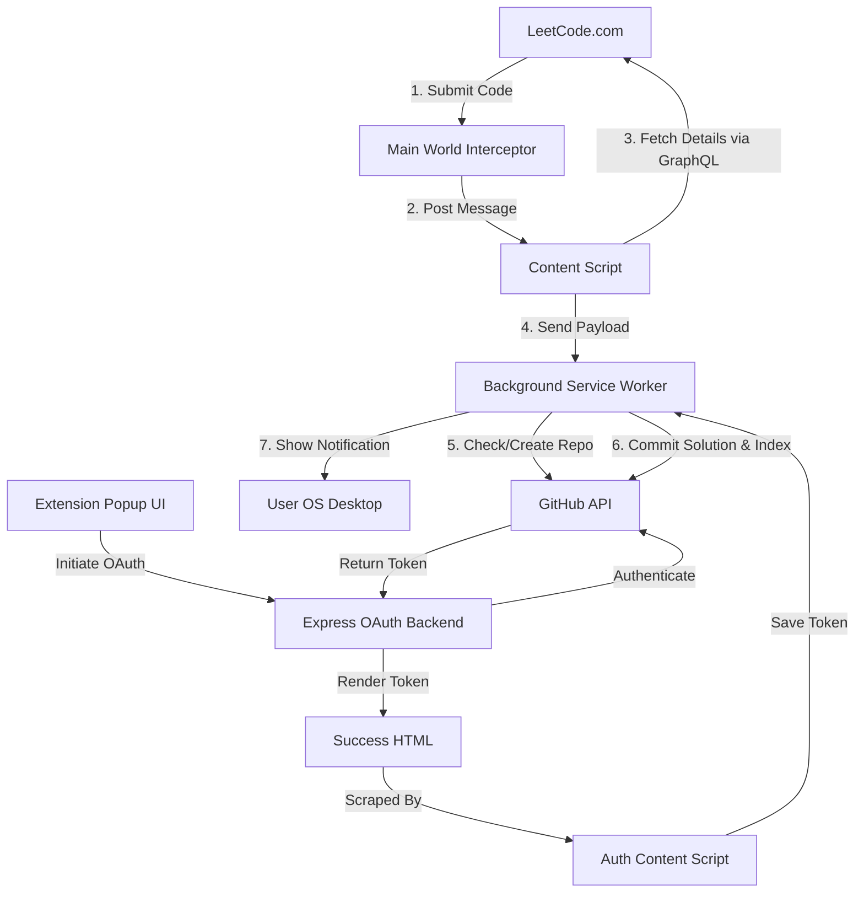

# 🔄 LeetCode GitHub Sync

**LeetCode GitHub Sync** is a production-ready Chrome Extension (Manifest V3) and companion Express OAuth backend that automatically syncs your accepted LeetCode solutions directly to your personal GitHub repository (`leetcode-solutions`), organizing them by difficulty and auto-generating a statistics-heavy `README.md`.

---

## 🏗 System Architecture



---

## 🛠 Tech Stack

- **Chrome Extension**: Manifest V3, Vite, React (JavaScript), Chrome Extension APIs (Storage, Tabs, Scripting, Notifications).
- **Backend Service**: Node.js, Express, Axios, CORS, dotenv.
- **VCS & API**: GitHub REST API (v3) with OAuth integration.

---

## 🚀 Local Setup Instructions

### 1. Register a GitHub OAuth Application
1. Go to your GitHub account settings: **Settings > Developer Settings > OAuth Apps > New OAuth App**.
2. Configure the following fields:
   - **Application Name**: `LeetCode GitHub Sync`
   - **Homepage URL**: `http://localhost:5000`
   - **Authorization callback URL**: `http://localhost:5000/auth/github/callback`
3. Click **Register application**.
4. Generate a **Client Secret** and copy both the **Client ID** and **Client Secret**.

### 2. Configure and Run the Backend
1. Navigate to the `backend` directory:
   ```bash
   cd backend
   ```
2. Create a `.env` file from the template:
   ```bash
   copy .env.example .env
   ```
3. Open `.env` and fill in your GitHub credentials:
   ```env
   GITHUB_CLIENT_ID=your_actual_client_id
   GITHUB_CLIENT_SECRET=your_actual_client_secret
   ```
4. Start the server in development mode:
   ```bash
   npm run dev
   ```
   The backend will start running at `http://localhost:5000`.

### 3. Build and Install the Chrome Extension
1. Navigate to the `chrome-extension` directory:
   ```bash
   cd chrome-extension
   ```
2. Build the extension:
   ```bash
   npm run build
   ```
   This compiles the React popup app and outputs the packed extension files inside the `chrome-extension/dist/` directory.
3. Install the unpacked extension in Chrome:
   - Open Chrome and navigate to `chrome://extensions/`.
   - Toggle **Developer mode** (top-right corner).
   - Click **Load unpacked** (top-left corner).
   - Select the **`chrome-extension/dist`** folder.
4. Pin the **LeetCode GitHub Sync** extension to your toolbar.

---

## 🎮 How to Use

1. Click the **LeetCode GitHub Sync** icon in your toolbar.
2. Click **Connect GitHub Account**. This opens a secure tab linking your profile.
3. Approve authorization on GitHub. The tab will automatically close and connect.
4. Set the **Auto Sync** toggle to your preference:
   - **Auto Sync ON**: Solving any LeetCode problem successfully (Accepted status) instantly pushes it to your GitHub repository in the background.
   - **Auto Sync OFF**: Accepted submissions are queued. You can open the popup and click **Sync to GitHub Now** to push manually.
5. Solve a LeetCode problem! The extension handles file creation, zero-padded numbering, comment metadata generation, and automatic README statistics compilation.

---

## 🌐 Production Deployment Instructions

To make this extension available for production/public use:

### 1. Deploy the OAuth Backend
Deploy the `backend` folder to a hosting provider like **Vercel, Render, Heroku, or Fly.io**.
- Set the environment variables (`GITHUB_CLIENT_ID`, `GITHUB_CLIENT_SECRET`, `GITHUB_REDIRECT_URI`) on your deployment dashboard.
- Update the redirect URI on GitHub's OAuth app page to point to `https://your-production-domain.com/auth/github/callback`.

### 2. Update the Extension Manifest & Content Scripts
Before compiling the production version of the Chrome extension, you need to point it to your production domain instead of `localhost:5000`:

1. In `chrome-extension/manifest.json`:
   - Replace `"http://localhost:5000/*"` in `host_permissions` with `"https://your-production-domain.com/*"`.
   - Update the second content script match from `"http://localhost:5000/auth/success*"` to `"https://your-production-domain.com/auth/success*"`.

2. In `chrome-extension/src/popup/Popup.jsx`:
   - Update the auth connection URL from `http://localhost:5000/auth/github` to `https://your-production-domain.com/auth/github`.

3. Re-run `npm run build` in the `chrome-extension` directory.
4. Compress the `dist` folder into a ZIP file and upload it to the **Chrome Web Store Developer Console**!
